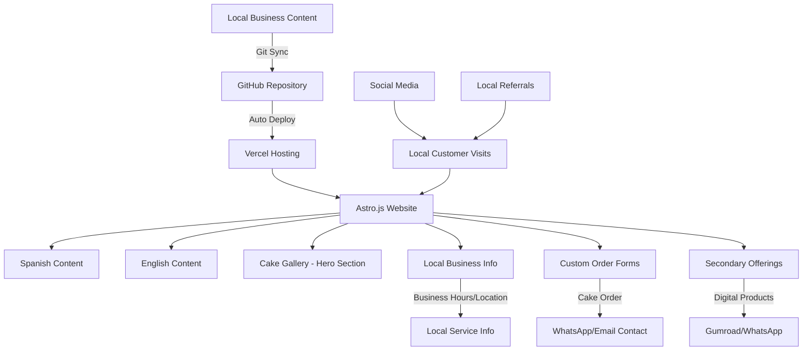

# Design Document

## Overview

The bilingual local cake business website is a modern, performance-optimized static site built with Astro.js that serves as the primary digital presence for a custom cake bakery. The design prioritizes showcasing artisan cake creations, facilitating custom orders, and building trust with local customers through professional presentation and clear business information.

The website follows a mobile-first, accessibility-compliant design approach with Spanish as the primary language and English as secondary. The architecture emphasizes the cake gallery as the hero section, with local business information prominently displayed, and secondary offerings (digital products/workshops) positioned as complementary services without competing with the core cake business.

## Architecture

### Technology Stack

**Frontend Framework**: Astro.js 4.x
- Static site generation with islands architecture for optimal performance
- Built-in i18n support for bilingual content management
- Component-based architecture supporting React/Vue components where needed
- Excellent SEO and Core Web Vitals performance out of the box

**Styling**: Tailwind CSS 3.x
- Utility-first CSS framework for rapid development
- Built-in responsive design utilities
- Custom color palette reflecting warm, inviting cooking brand
- Dark mode support for accessibility

**Content Management**: Simple File-Based System
- Easy image upload and replacement for cake gallery
- Simple text file updates for business information
- Git-based deployment workflow for content updates
- Focus on cake photos and local business data

**Contact Integration**: Multi-Channel Communication
- WhatsApp integration for quick cake consultations
- Email contact forms for detailed custom orders
- Phone contact prominently displayed
- Local business hours and service area information

**Deployment**: Vercel
- Automatic deployments from Git repository
- Edge network for global performance
- Preview deployments for content review
- Custom domain support with SSL

### System Architecture Diagram



## Components and Interfaces

### Core Components

#### 1. Language Switcher Component
```typescript
interface LanguageSwitcherProps {
  currentLocale: 'es' | 'en';
  currentPath: string;
}
```
- Toggle between Spanish and English
- Preserves current page context when switching
- Accessible keyboard navigation
- Visual indicator for active language

#### 2. Cake Gallery Component (Hero Section)
```typescript
interface CakeGalleryProps {
  featuredCakes: Array<{
    src: string;
    alt: string;
    title: string;
    occasion: 'wedding' | 'birthday' | 'celebration' | 'custom';
    description: string;
    designElements: string[];
  }>;
  layout: 'hero-grid';
}
```

- Prominent hero section showcasing custom cake work
- High-quality cake photos with detailed descriptions
- Occasion-based categorization (wedding, birthday, etc.)
- Design element highlights (fondant work, buttercream, etc.)
- Clear "Order Custom Cake" call-to-action integration

#### 3. Local Business Info Component
```typescript
interface LocalBusinessProps {
  businessName: string;
  address: string;
  serviceArea: string[];
  hours: {
    [day: string]: string;
  };
  contact: {
    phone: string;
    email: string;
    whatsapp: string;
  };
  leadTimes: {
    standard: string;
    wedding: string;
    rush: string;
  };
}
```

- Prominent display of business hours and contact information
- Clear service area and delivery zone information
- Lead time expectations for different cake types
- Multiple contact methods (phone, email, WhatsApp)
- Local business credibility elements

#### 4. Custom Cake Order Form Component
```typescript
interface CakeOrderFormProps {
  fields: {
    customerInfo: ['name', 'phone', 'email'];
    eventDetails: ['eventDate', 'eventType', 'guestCount'];
    cakeSpecs: ['size', 'flavors', 'designPreferences', 'dietaryRestrictions'];
    logistics: ['deliveryAddress', 'deliveryTime', 'specialInstructions'];
  };
  serviceArea: string[];
  leadTimeValidation: boolean;
}
```

- Comprehensive custom cake ordering system
- Event-specific information collection
- Service area validation for delivery
- Lead time checking against event dates
- Integration with WhatsApp and email for follow-up

#### 5. Customer Testimonial Component
```typescript
interface CakeTestimonialProps {
  testimonials: Array<{
    content: string;
    customerName: string;
    occasion: string;
    cakePhoto?: string;
    rating: number;
    location: string;
    date: string;
  }>;
  displayMode: 'carousel' | 'grid';
}
```

- Local customer success stories with cake photos
- Occasion-specific testimonials (weddings, birthdays)
- Customer photos of delivered cakes
- Local area references for credibility
- Rating system for social proof

#### 6. Secondary Offerings Component
```typescript
interface SecondaryOfferingsProps {
  offerings: Array<{
    title: string;
    description: string;
    type: 'digital' | 'workshop';
    price?: number;
    link: string;
  }>;
  position: 'sidebar' | 'footer-section';
}
```

- Clearly separated from main cake business
- Positioned as "Also Available" or "Learn More"
- Non-competing presentation style
- Easy navigation back to cake services

### Content Collections Schema

#### Cake Gallery Collection
```typescript
const cakeGallerySchema = z.object({
  title: z.string(),
  occasion: z.enum(['wedding', 'birthday', 'celebration', 'custom']),
  description: z.string(),
  designElements: z.array(z.string()),
  images: z.array(z.object({
    src: z.string(),
    alt: z.string(),
    caption: z.string(),
  })),
  featured: z.boolean().default(false),
  order: z.number(),
});
```

#### Local Business Info Collection
```typescript
const businessInfoSchema = z.object({
  businessName: z.string(),
  address: z.string(),
  serviceArea: z.array(z.string()),
  hours: z.record(z.string()),
  contact: z.object({
    phone: z.string(),
    email: z.string(),
    whatsapp: z.string(),
  }),
  leadTimes: z.object({
    standard: z.string(),
    wedding: z.string(),
    rush: z.string(),
  }),
});
```

#### Customer Testimonials Collection
```typescript
const customerTestimonialsSchema = z.object({
  content: z.string(),
  customerName: z.string(),
  occasion: z.string(),
  cakePhoto: z.string().optional(),
  rating: z.number().min(1).max(5),
  location: z.string(),
  date: z.date(),
  featured: z.boolean().default(false),
});
```

#### Secondary Offerings Collection
```typescript
const secondaryOfferingsSchema = z.object({
  title: z.string(),
  description: z.string(),
  type: z.enum(['digital', 'workshop']),
  price: z.number().optional(),
  link: z.string(),
  order: z.number(),
});
```

## Data Models

### Internationalization Structure

```
src/
├── content/
│   ├── es/
│   │   ├── pasteles/
│   │   ├── testimonios/
│   │   ├── negocio/
│   │   └── ofertas-adicionales/
│   └── en/
│       ├── cakes/
│       ├── testimonials/
│       ├── business/
│       └── additional-offerings/
├── i18n/
│   ├── es.json
│   └── en.json
└── pages/
    ├── es/
    │   ├── index.astro
    │   ├── galeria-pasteles.astro
    │   └── pedido-personalizado.astro
    └── en/
        ├── index.astro
        ├── cake-gallery.astro
        └── custom-order.astro
```

### Content Frontmatter Standards

#### Cake Gallery Content
```yaml
---
title: "Pastel de Boda Elegante"
occasion: "wedding"
description: "Pastel de tres pisos con flores de azúcar hechas a mano"
designElements: ["fondant", "flores de azúcar", "decoración floral"]
images:
  - src: "/images/wedding-cake-1.jpg"
    alt: "Pastel de boda con flores rosas"
    caption: "Vista frontal del pastel terminado"
featured: true
order: 1
seo:
  metaDescription: "Pasteles de boda personalizados con flores de azúcar"
  ogImage: "/images/wedding-cake-og.jpg"
---
```

#### Business Information Content
```yaml
---
businessName: "Repostería Artesanal [Nombre]"
address: "Dirección Local, Ciudad"
serviceArea: ["Centro", "Norte", "Sur de la Ciudad"]
hours:
  lunes: "9:00 AM - 6:00 PM"
  martes: "9:00 AM - 6:00 PM"
  miercoles: "9:00 AM - 6:00 PM"
  jueves: "9:00 AM - 6:00 PM"
  viernes: "9:00 AM - 7:00 PM"
  sabado: "10:00 AM - 4:00 PM"
  domingo: "Cerrado"
contact:
  phone: "+1-XXX-XXX-XXXX"
  email: "pedidos@reposteria.com"
  whatsapp: "+1-XXX-XXX-XXXX"
leadTimes:
  standard: "1 semana mínimo"
  wedding: "2 semanas mínimo"
  rush: "Disponible con cargo adicional"
---
```

## Error Handling

### Content Validation Errors

**Missing Required Fields**: When content files lack required frontmatter fields, the build process will fail with clear error messages indicating which files and fields need attention.

**Invalid Pricing Data**: PPP multipliers outside acceptable ranges (0.1-1.0) will trigger validation errors with suggested corrections.

**Broken Links**: Gumroad links and internal references are validated during build, with fallback to WhatsApp contact for broken payment links.

### Runtime Error Handling

**Image Loading Failures**: Gallery component includes fallback placeholder images with clear labeling for missing content.

**Form Submission Errors**: Contact forms provide bilingual error messages and retry mechanisms for network failures.

**Payment Integration Failures**: Gumroad integration includes fallback to WhatsApp contact with clear instructions for manual payment processing.

### Graceful Degradation

**JavaScript Disabled**: All core functionality remains accessible without JavaScript, including navigation, content viewing, and contact forms.

**Slow Connections**: Progressive loading with skeleton screens and optimized image delivery ensures usability on slower networks.

**Older Browsers**: CSS fallbacks and progressive enhancement ensure compatibility with browsers lacking modern features.

## Testing Strategy

### Content Testing

**Frontmatter Validation**: Automated tests verify all content files include required fields and valid data types.

**Link Validation**: Automated checking of all external links, especially Gumroad product links and WhatsApp contact URLs.

**Bilingual Content Parity**: Tests ensure Spanish and English content maintain equivalent structure and completeness.

### Functional Testing

**Language Switching**: Verify language toggle preserves page context and updates all UI elements correctly.

**Form Functionality**: Test contact forms with various input combinations and validation scenarios.

**Payment Flow Testing**: Verify Gumroad integration and WhatsApp fallback flows work correctly.

### Performance Testing

**Core Web Vitals**: Automated testing for LCP, FID, and CLS metrics on both desktop and mobile.

**Image Optimization**: Verify lazy loading, WebP/AVIF delivery, and responsive image sizing.

**Accessibility Testing**: Automated and manual testing for WCAG 2.1 AA compliance.

### Cross-Browser Testing

**Modern Browsers**: Chrome, Firefox, Safari, Edge on desktop and mobile
**Legacy Support**: IE11 graceful degradation testing
**Mobile Devices**: iOS Safari, Android Chrome, Samsung Internet

### Integration Testing

**Obsidian Vault Sync**: Test content updates from vault to website deployment
**Gumroad Webhooks**: Verify order confirmation and customer data handling
**Email/WhatsApp Integration**: Test contact form submissions and automated responses

The testing strategy emphasizes automated validation where possible while ensuring manual testing covers user experience and business-critical flows like payment processing and contact management.